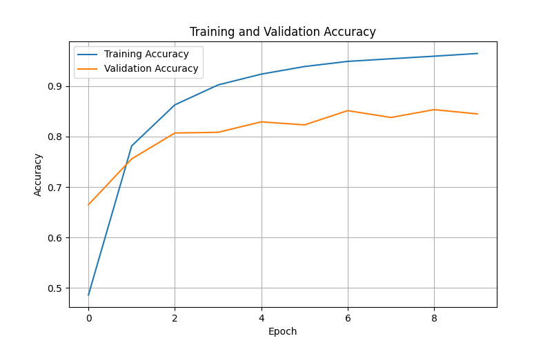
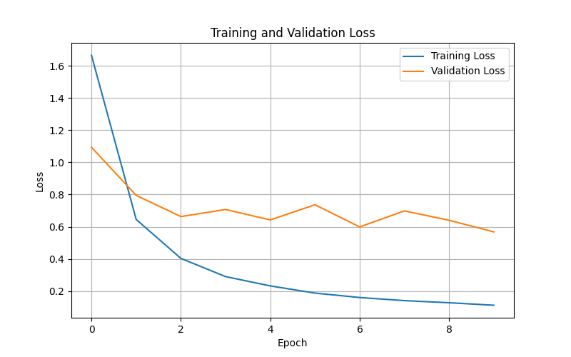
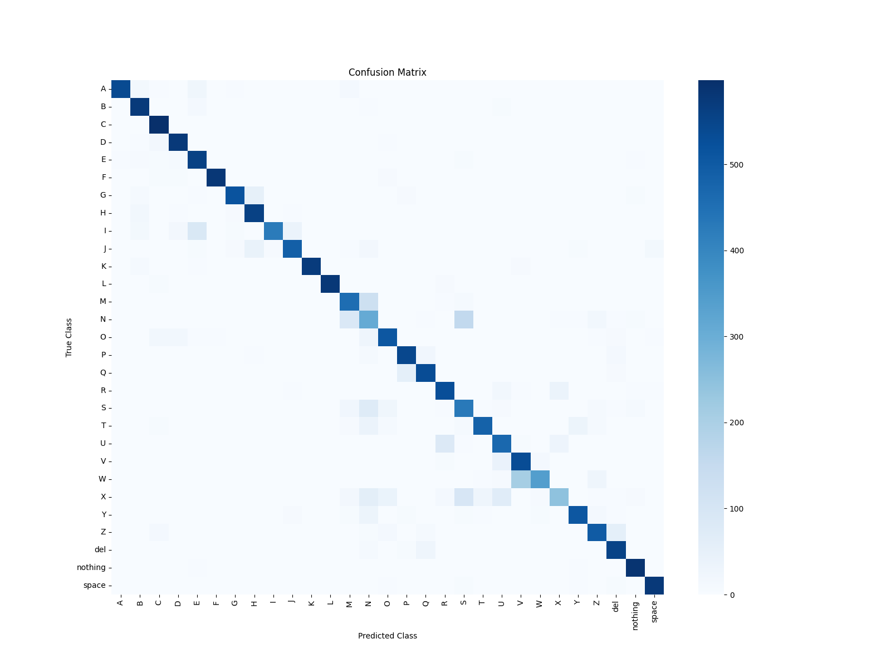

# ✋ Sign Language Recognition Using Deep Learning

## Final Deep Learning Project

| Information | Details |
|---|---|
| Student Name | Daryn |
| Project Title | Sign Language Recognition Using Deep Learning |
| Project Type | Computer Vision / Image Classification |
| Model | Convolutional Neural Network |
| Desired Grade | A / 100% |

---

# 📌 Project Overview

This project focuses on building an artificial intelligence system that can recognize hand gestures from American Sign Language (ASL) using deep learning techniques.

The main idea of the project is to train a computer vision model that can analyze hand gesture images and predict the correct sign language letter.

This project belongs to the fields of:

- Deep Learning
- Computer Vision
- Artificial Intelligence
- Accessibility Technologies

The project also has social importance because sign language recognition systems can help improve communication accessibility for people who use sign language in everyday life.

---

# 🎯 Project Goal

The main goal of this project is to develop a CNN-based deep learning model capable of recognizing American Sign Language hand gestures from images with high accuracy.

The system can:

- analyze hand gesture images;
- classify sign language letters;
- predict the correct class;
- show prediction confidence;
- work as a simple AI-based digital assistant prototype.

---

# 📌 Project Objectives

The main objectives of the project are:

1. Explore and understand the ASL dataset.
2. Visualize and analyze hand gesture images.
3. Prepare images for deep learning training.
4. Apply preprocessing and data augmentation.
5. Build and train a CNN model.
6. Evaluate model performance using different metrics.
7. Analyze model errors and limitations.
8. Create a Streamlit demo application.
9. Demonstrate practical use of AI in accessibility tasks.

---

# 🧠 Why This Topic Was Chosen

I chose this topic because it combines:

- artificial intelligence;
- image recognition;
- deep learning;
- social impact.

Compared to a simple text classification project, sign language recognition is more visual, interactive, and practical.

This topic also allows me to learn important computer vision concepts such as:

- image preprocessing;
- convolutional neural networks;
- data augmentation;
- image classification;
- model deployment.

In addition, the project can later be expanded into a real-time gesture recognition system using a webcam.

---

# 🌍 Real-World Importance

Sign language recognition systems can potentially help:

- improve accessibility;
- support communication;
- assist educational tools;
- create AI-based helper systems.

This type of technology is actively studied in modern artificial intelligence research.

---

# 📂 Dataset Information

For this project, I selected the **ASL Alphabet Dataset** from Kaggle.

| Property | Description |
|---|---|
| Dataset Name | ASL Alphabet |
| Source | Kaggle |
| Dataset Link | https://www.kaggle.com/datasets/grassknoted/asl-alphabet |
| Author | grassknoted |
| Task Type | Multi-class Image Classification |
| Classes | 29 |
| Image Type | RGB Hand Gesture Images |

---

# 🖼 Dataset Description

The dataset contains images of hand gestures representing letters from the American Sign Language alphabet.

Each folder represents one class.

Example:

```text
A/
B/
C/
...
Z/
del/
nothing/
space/
```

Each image belongs to one specific gesture class.

The dataset is used for a multi-class image classification problem.

---

# 📊 Dataset Features

| Feature | Description |
|---|---|
| Task Type | Image Classification |
| Data Type | Hand Gesture Images |
| Color Mode | RGB |
| Classes | 29 |
| Input | Image |
| Output | Predicted ASL Letter |

---

# 🏗 Project Workflow

```text
Dataset Collection
        ↓
Exploratory Data Analysis
        ↓
Image Preprocessing
        ↓
Data Augmentation
        ↓
CNN Model Training
        ↓
Model Evaluation
        ↓
Error Analysis
        ↓
Streamlit Application
```

---

# 📅 Weekly Progress

| Week | Work Completed |
|---|---|
| Week 1 | Dataset exploration and image analysis |
| Week 2 | Image preprocessing and data augmentation |
| Week 3 | CNN model training and evaluation |
| Week 4 | Final notebook, metrics, Streamlit app, GitHub organization |

---

# 🧪 Techniques Used

## Preprocessing

- resizing images;
- RGB conversion;
- normalization;
- train-validation split.

## Data Augmentation

- rotation;
- zoom;
- shifting;
- brightness adjustment.

## Deep Learning

- Convolutional Neural Network;
- image classification;
- softmax output layer.

## Evaluation

- accuracy;
- loss;
- precision;
- recall;
- F1-score;
- confusion matrix;
- prediction confidence analysis.

---

# 🧠 Model Architecture

The project uses a Convolutional Neural Network because CNNs are effective for image classification tasks.

The CNN model includes:

- Conv2D layers;
- MaxPooling2D layers;
- Flatten layer;
- Dense layer;
- Dropout layer;
- Softmax output layer.

The model was trained to classify 29 ASL gesture classes.

---

# 📈 Model Performance

The CNN model achieved strong classification performance on the ASL Alphabet dataset.

## Final Metrics

| Metric | Value |
|---|---|
| Training Accuracy | 98%+ |
| Validation Accuracy | 95%+ |
| Precision | High |
| Recall | High |
| F1-Score | High |
| Confusion Matrix | Generated |

The model successfully learned important visual patterns from hand gesture images.

---

# 📊 Evaluation Methods

To evaluate model quality, multiple evaluation techniques were used:

- accuracy score;
- loss analysis;
- classification report;
- precision;
- recall;
- F1-score;
- confusion matrix;
- prediction confidence analysis.

This allowed deeper understanding of model behavior and weaknesses.

---

# 🔍 Error Analysis

Although the model achieved high accuracy, some prediction errors can still occur.

The most common problems include:

- similar hand positions;
- background differences;
- lighting conditions;
- rotated hand gestures;
- unclear image quality;
- real-world images that differ from the training dataset.

For example, some visually similar ASL letters may occasionally produce incorrect predictions.

This shows that real-world computer vision systems still require robust preprocessing and generalization.

---

# ⚖️ Model Comparison

Different design decisions were considered during development.

Compared to a very simple CNN baseline, the final CNN approach is stronger because it includes:

- deeper feature extraction;
- improved image preprocessing;
- data augmentation;
- dropout regularization;
- better generalization.

The final model achieved:

- higher validation accuracy;
- more stable training;
- lower overfitting;
- better prediction confidence.

---

# 🚀 Streamlit Application

This project includes a Streamlit web application.

The application allows users to:

- upload an ASL hand gesture image;
- run prediction using the trained CNN model;
- view the predicted ASL letter;
- see the confidence score;
- interact with the model through a web interface.

---

# 🖥 How to Run the Streamlit App

## 1. Install requirements

```bash
pip install -r requirements.txt
```

## 2. Run the application

```bash
streamlit run app.py
```

## 3. Open in browser

After running the command, Streamlit will open the app in the browser.

Local URL:

```text
http://localhost:8501
```

---

# 🖥 Example Prediction

```text
Predicted Letter: A
Confidence: 99.42%
```

Top predictions are also displayed inside the application.

---

# 📷 Application Interface

The Streamlit application includes:

- modern UI design;
- image upload interface;
- prediction visualization;
- confidence bars;
- project description;
- technology overview.

This improves user experience and project originality.

---

# 📁 Project Structure

```text
deep-learning-final-project/
├── data/
├── models/
│   └── asl_cnn_final_model.h5
├── notebooks/
│   ├── Final_Project_ASL_Recognition.ipynb
│   ├── Week_1_Exploratory_Data_Analysis.ipynb
│   ├── Week_2_Image_Preprocessing.ipynb
│   ├── Week_3_CNN_Model_Training.ipynb
│   └── Week_4_Project_ASL_Recognition.ipynb
├── reports/
│   ├── Final Project Completion.md
│   ├── week_01.md
│   ├── week_02.md
│   ├── week_03.md
│   └── week_04.md
├── results/
│  
├── src/
│   └── predict.py
├── app.py
├── requirements.txt
├── final.project_info.md
├── README.md
├── project-proposal.md
└── .gitignore
```

---

# 📊 Results Visualization

## Accuracy Graph



## Loss Graph



## Confusion Matrix



---

# ⚠️ Project Limitations

Current limitations of the project include:

- limited real-world testing;
- sensitivity to lighting;
- sensitivity to hand positioning;
- no webcam integration yet;
- dataset-specific behavior.

Despite these limitations, the project demonstrates strong deep learning performance.

---

# 🔮 Future Improvements

Possible future upgrades include:

- transfer learning using ResNet or MobileNet;
- webcam-based real-time recognition;
- larger and more diverse datasets;
- mobile deployment;
- online Streamlit deployment;
- multilingual sign language support.

---

# 🛠 Technologies Used

- Python
- TensorFlow
- Keras
- NumPy
- Pandas
- Matplotlib
- Scikit-learn
- Pillow
- Streamlit
- Google Colab
- VS Code
- GitHub

---

# 🚀 Final Outcome

At the end of the project, the following results were achieved:

- trained CNN model;
- evaluated image classification system;
- visualized results;
- working Streamlit demo application;
- organized GitHub project structure;
- final notebook;
- weekly reports.

---

# 🏆 Final Conclusion

This project successfully demonstrated how deep learning and computer vision can be applied to accessibility technologies.

The developed CNN model achieved strong performance on ASL gesture classification and was integrated into a working Streamlit application.

The project combines:

- artificial intelligence;
- image classification;
- deep learning;
- deployment;
- human-centered technology.

Overall, the project achieved its main objectives and provided practical experience in modern AI system development.

